# CircleFormer: Circular Nuclei Detection in Whole Slide Images with Circle Queries and Attention

The network architecture of CircleFormer-D-Joint is shown in the figure below:

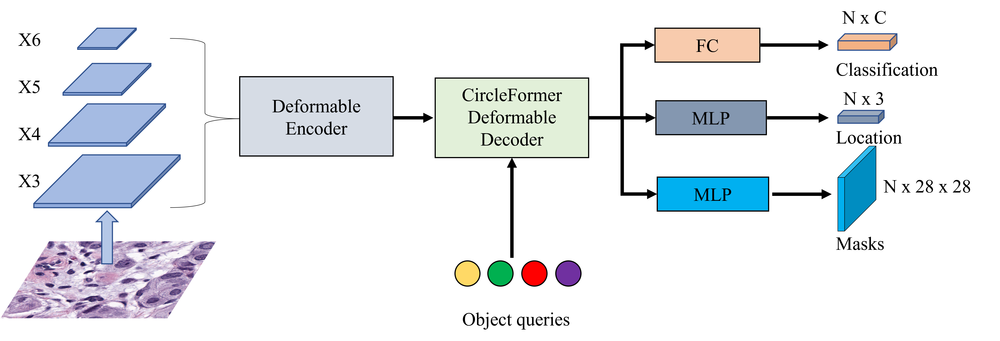

Visual results for this code are available in a OneDrive folder, which can be accessed at <https://1drv.ms/f/s!AuNCi9q4ybezhjn2SHsT1bUObgJ3?e=fSdn7q>

|  Microscopic image | Ground Truth  | Ours | QueryInst| SOIT| CircleNet-HG |
|  ----  | ----  | --- | --- | --- | --- |
| 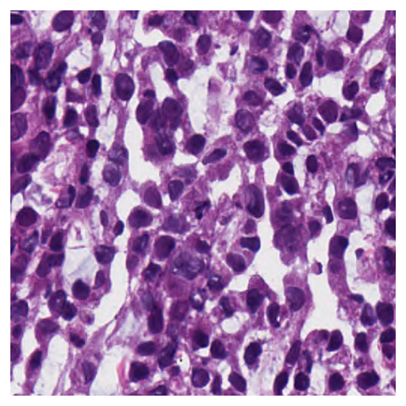  | 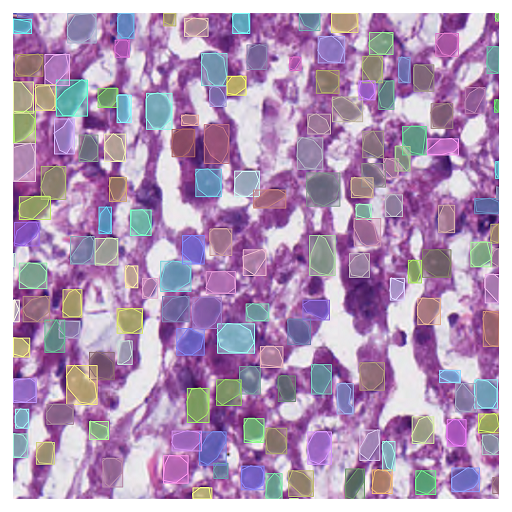 | 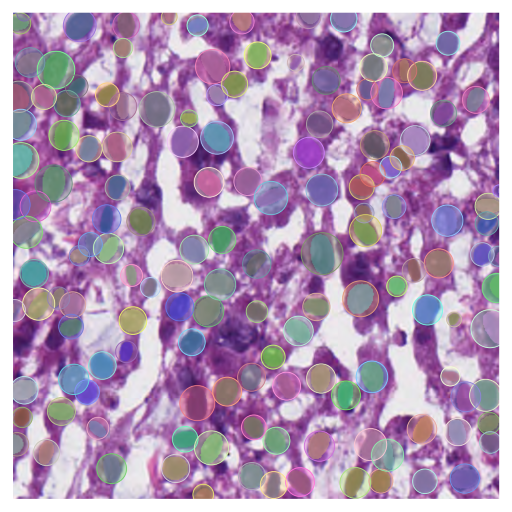 | 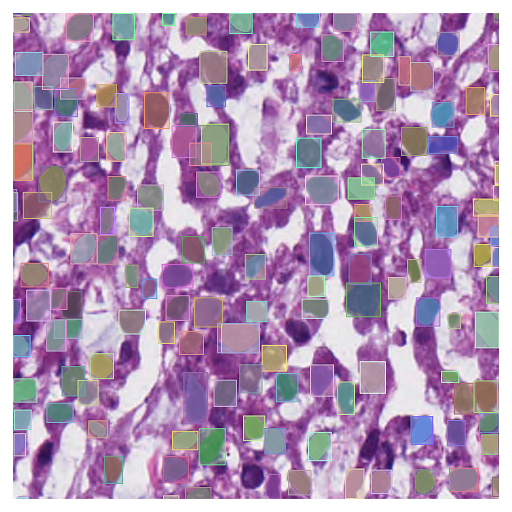 | 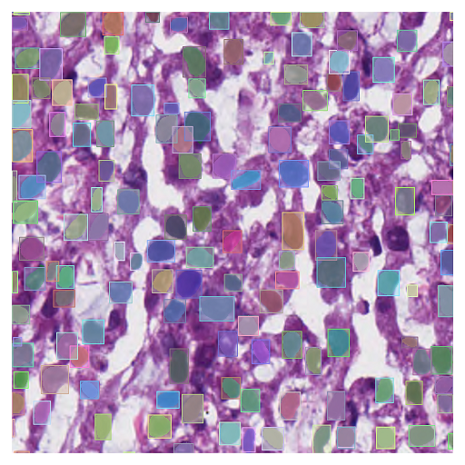 | 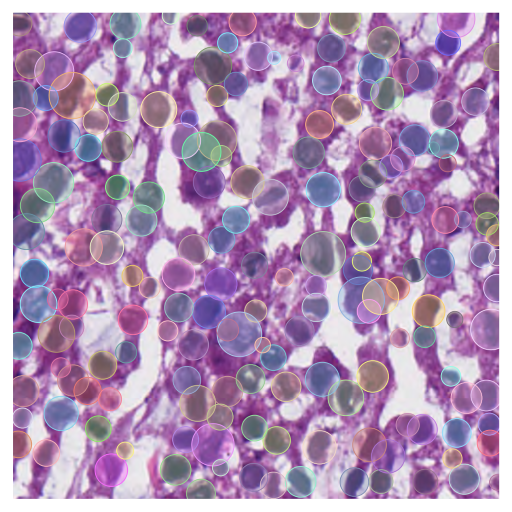|
| 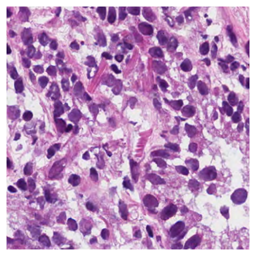  | 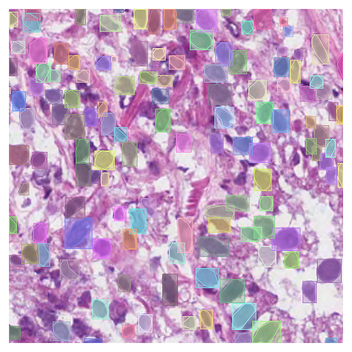 | 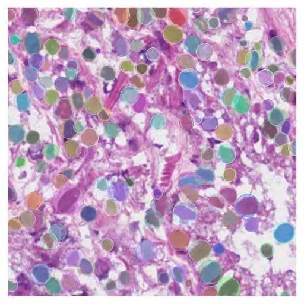 | 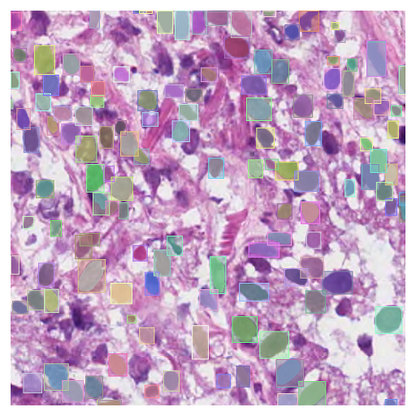 | 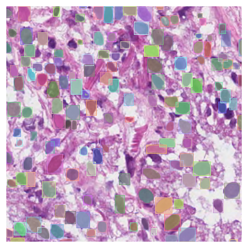 | 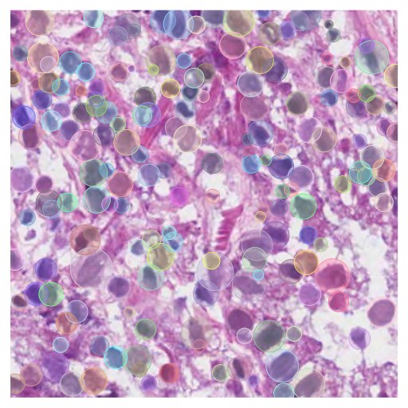|
| 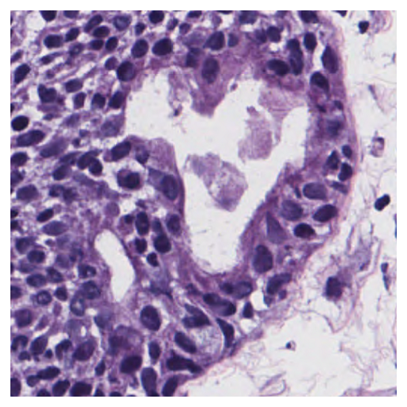  | 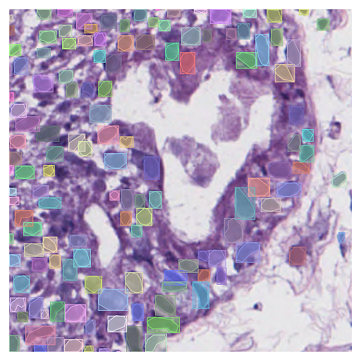 | 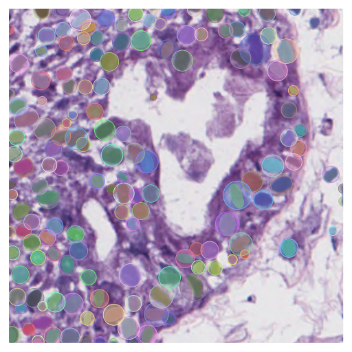 | 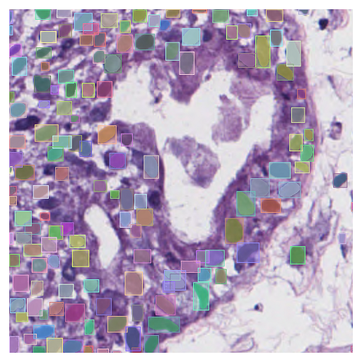 | 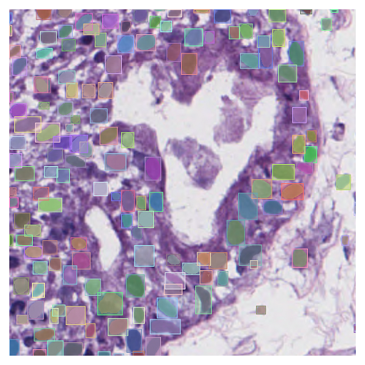 | 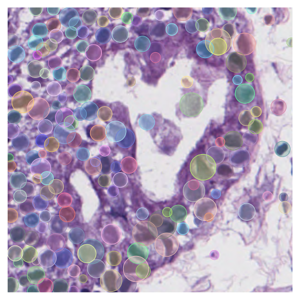|